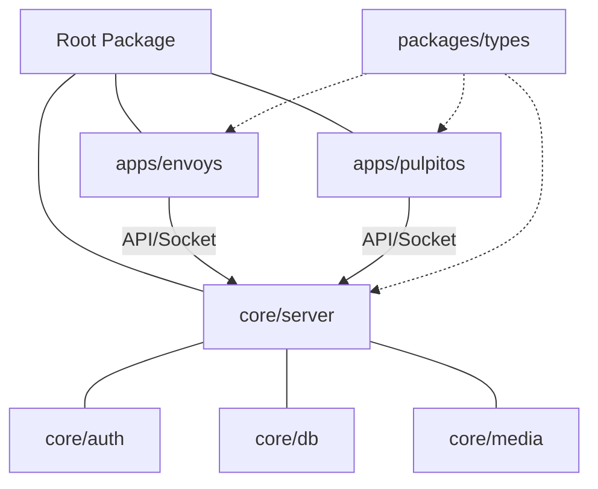

# Codebase Audit: Envoys OS Modular Transformation

## Current State Analysis (V2.1.0 Modular Edition)
The transformation from a monolithic to a modular architecture has been successfully initiated. The backend is now decomposed into logical modules within `/core`, and the products are isolated in `/apps`.

### Migration Progress:
- [x] **Core Extraction**: Auth, DB (Prisma), and Media are now separate modules.
- [x] **Monorepo Setup**: Workspaces configured for `apps`, `core`, and `packages`.
- [x] **Product Isolation**: Envoys moved to `apps/envoys`, PulpitOS scaffolded in `apps/pulpitos`.
- [x] **Prisma Integration**: Unified database layer using PostgreSQL/Prisma instead of direct SQLite.

### Key Components:
- **Modular Server**: `core/index.js` now imports logic from `core/auth`, `core/db`, and `core/media`.
- **Media Module**: Supports S3-compatible storage (with local disk fallback).
- **Core DB**: Source of truth for both products.

## Target Architecture (Implemented)

## Migration Path: Next Steps
1.  **Type Unification**: Move all TypeScript interfaces into `@envoys/types`.
2.  **Shared UI**: Extract common components into `@envoys/ui`.
3.  **Analytics Service**: Implement the tracking hooks in `core/analytics`.
4.  **Distribution Pipeline**: Build out the PulpitOS ingestion logic.

---

> [!IMPORTANT]
> The infrastructure is now ready for scale. The "live service" and "post-service" lifecycles are logically separated while sharing the same underlying data models.
