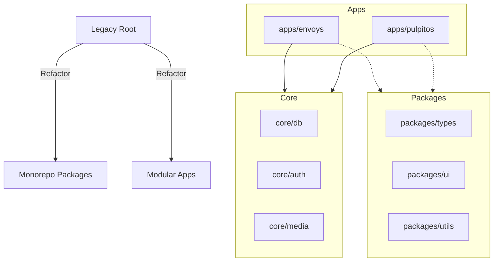

# Codebase Audit: Envoys OS Modular Transformation

## Current State Analysis (V2.0.0 Monolith)
The existing Envoys OS is a classic "all-in-one" system where the backend and frontend are tightly coupled within single directories (`server/` and `client/`). 

### Key Findings:
- **Server Monolith**: `server/index.js` handles routing, database, socket.io, authentication, and file storage in a single 400-line file.
- **Database Hybrid**: The server uses both `sqlite3` directly and has a partial `prisma` schema, creating an inconsistent data layer.
- **Client Coupling**: The frontend stores state, types, and logic internally, making it difficult to share with the future PulpitOS.
- **Dependency Duplication**: Both client and server manage their own `package.json` without a shared monorepo context.

## Refactoring Strategy

### 1. Extraction: The Bridge Architecture
We are moving to a **core-first** architecture. Data and critical business logic (Auth, DB, Media) will live in `/core`, accessible to any application in `/apps`.

| Component | Destination | Reasoning |
| :--- | :--- | :--- |
| **Prisma Schema** | `/core/db` | Unified source of truth for all products. |
| **Auth Logic** | `/core/auth` | Shared JWT and User/Church context. |
| **Socket logic** | `/packages/sdk` | Real-time communication must be reusable. |
| **UI Components** | `/packages/ui` | Consistent design language across all products. |

### 2. Isolation: Envoys AI vs PulpitOS
- **Envoys AI**: Now lives in `/apps/envoys`. Focused strictly on the "live service moment" (Timers, OBS, Live Overlays).
- **PulpitOS**: Initial foundation in `/apps/pulpitos`. Focused on the "post-service lifecycle" (Distribution, Archives, Analytics).

## Transformation Map

## Non-Negotiable Rules
1. **Preserve Envoys Speed**: The refactoring must not introduce latency in the timer or real-time display.
2. **Unified Org Layer**: Both products must share the `Organization` (Church) context.
3. **No Logic Bleed**: PulpitOS features (e.g. YouTube Distribution) must NOT be coded into the Envoys codebase. They communicate via the `/core` API.

---

> [!IMPORTANT]
> This is a structural transformation. Functional changes to Envoys should be paused until the monorepo structure is stable.
